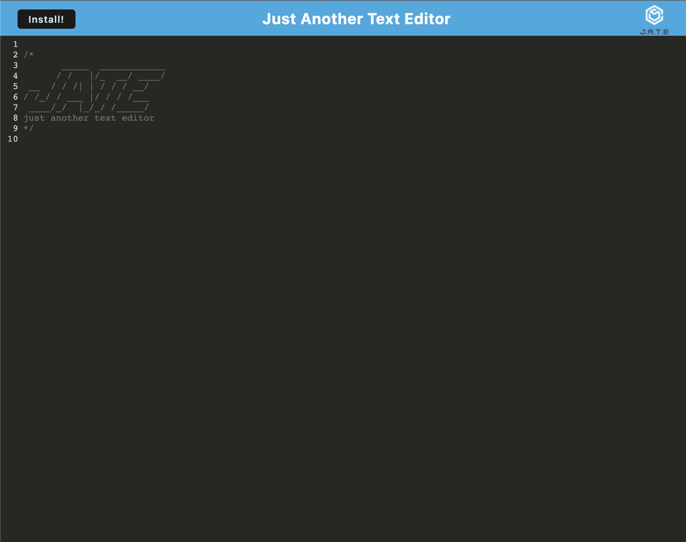

# PWA Text Editor 

## Description

PWA Text Editor is a single-page application that meets the PWA criteria. Additionally, it will feature a number of data persistence techniques that serve as redundancy in case one of the options is not supported by the browser. The application will also function offline.


## Installation
To install dependencies, run the following command for both the client and server sides:
```
npm install
```
After installing node modules, run this command to create the dist folder:
```
npm run build
```

# Usage
To start PWA Text Editor enter command in your terminal:
```
npm run start
```
After the successful start of the server go to http://localhost:3000/ to run this application on your local machine. Click the `Install` button to download the application.


## Screenshots/Video



Repo for app can be found at https://github.com/rroip/PWA-Text-Editor

## Contributor:
Stan Sitnitski
sitnitsky.s@gmail.com
<br/>

<br/><br/>
